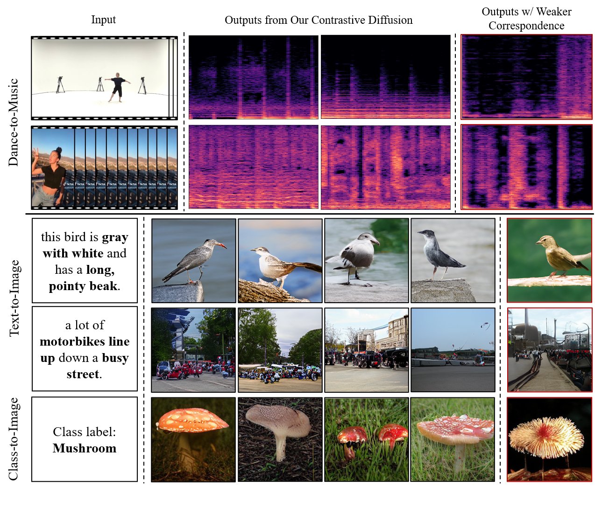

# Conditional Discrete Contrastive Diffusion (CDCD)
 This is the implementation of the **Conditional Discrete Contrastive Diffusion** approach for cross-modal and conditional generation **(ICLR2023)**.

Ye Zhu, Yu Wu, Kyle Olszewski, Jian Ren, Sergey Tulyakov, Yan Yan

 [Paper](https://arxiv.org/abs/2206.07771) | [Project Page](https://l-yezhu.github.io/CDCD/)

### Updates:

- (04/2023) Also super exicited to introduce my new series of work in **#AI4Science** and **#ML4Astrophysics**, where we apply the diffusion generative models to solve real scientific problems in astronomy for the star formation in universe. Specifically, we adapt the DDPM formulation to predict the density of molecular clouds, and achieve **an order of magnitude improvement** on the prediction accuracy over the existing physical methods. [Full paper](https://arxiv.org/abs/2304.01670) accecpted to The Astrophysical Journal ([Top-1 Journal in Astro](https://scholar.google.com/citations?view_op=top_venues&hl=en&vq=phy_astronomyastrophysics)), short version can also be found in [ICLR23 Physics4ML Workshop](https://openreview.net/forum?id=KiwRgaRYqRE).

- If you are interested in applying pre-trained and frozen diffusion models for various downstream applications such as image editing, please also check my recent work [Boundary Guided Mixing Trajectory for Semantic Control with Diffusion Models](https://arxiv.org/abs/2302.08357), in which we introduce a **non-learning based** (thus super light-weight) method for image semantic control and manipulation by denoising trajectory guidance, thanks! (Code and project page will be released soon, stay tuned!)   


 ## 1. Project Overview
 In this work, we introduce our Conditional Discrete Contrastive Diffusion (CDCD) approach to enhance the input-output connections in cross-modal and conditional generation. 
 Specifically, we tackle the problem by maximizing the mutual information between the given input and the generated output via contrastive learning.
 We demonstrate the efficacy of the proposed approach in evaluations with three diverse, multimodal conditional synthesis tasks on five datasets: dance-to-music generation on AIST++ and TikTok Dance-Music, text-to-image synthesis on CUB200 and MSCOCO, and class-conditioned image synthesis on ImageNet.

 <p align="center">
    

## 2. Environment Setup
The environment can be set up following the instructions below.
The dance-to-music task requires the pretrained [JukeBox model](https://github.com/openai/jukebox), and the text-to-image task loads the pre-trained [DALL-E model](https://github.com/openai/DALL-E).

```
conda create --name cdcd python=3.8
source activate cdcd
conda install mpi4py==3.0.3
# install the pytorch and cudatoolkit based on your machine.
conda install pytorch==1.8.0 torchvision==0.9.0 torchaudio==0.8.0 cudatoolkit=11.1 -c pytorch -c conda-forge
git clone https://github.com/L-YeZhu/CDCD.git
cd CDCD
pip install -r requirements.txt
cd ./synthesis/modeling/models/
pip install -e .
```


## 3. Dataset
We conduct experiments on three diverse cross-modal and conditional generation tasks on five datasets: dance-to-music generation, text-to-image synthesis, and class-conditioned image synthesis.

### 3.1 AIST++ Dataset for Dance-to-Music
The AIST++ dataset is a subset of AIST dataset, which can be downloaded from [here](https://google.github.io/aistplusplus_dataset/download.html). We use the cross-modality data split for training and testing. 

### 3.2 TikTok Dance-Music Dataset for Dance-to-Music
The TikTok Dance-Music dataset includes the dance videos with paired music collected from "in the wild" environment, which can be downloaded from [here](https://github.com/L-YeZhu/D2M-GAN).

### 3.3 Text-to-Image Datasets
We follow the dataset preprations similar to the [VQ-Diffusion](https://github.com/cientgu/VQ-Diffusion) for the CUB200, MSCOCO, and ImageNet.


## 4. Training

Please check and modify all the paths in the config files to match your machine before running experiments.

Here are some pre-trained models for use: [AIST++](https://drive.google.com/file/d/1hUSnEAbuoxZC7NLQHn_2IEgC46eB3MST/view?usp=share_link), [TikTok](https://drive.google.com/file/d/1wZnMMeIH0wlGs9lRx7qa0lF27oI5tjur/view?usp=share_link), [CUB200](https://drive.google.com/file/d/1WedoI9KDbwr4hYJ9vg91ho8MgmGHFaBr/view?usp=share_link).


### 4.1 Default training
To perform dance-to-music on AIST++. This default setting trains contrastive diffusion model with 80 steps with step-wise parallel contrastive diffusion and intra-negative music samples.

```
CUDA_VISIBLE_DEVICES=#IDS python running_command/run_train_aist.py 
```

To perform dance-to-music on TikTok Dance-Music. This default setting trains contrastive diffusion model with 80 steps with step-wise parallel contrastive diffusion and intra-negative music samples.

```
CUDA_VISIBLE_DEVICES=#IDS python running_command/run_train_tiktok.py 
```

To perform text-to-image on CUB200. This default setting trains contrastive diffusion model with 80 steps with sample-wise auxiliary diffusion and inter-negative image samples.

```
CUDA_VISIBLE_DEVICES=#IDS python running_command/run_train_cub.py 
```

To perform text-to-image on MSCOCO. This default setting trains contrastive diffusion model with 80 steps with step-wise parallel diffusion and intra-negative image samples.

```
CUDA_VISIBLE_DEVICES=#IDS python running_command/run_train_coco.py 
```

To perform class conditioned image synthesis on ImageNet. This default setting trains contrastive diffusion model with 80 steps with step-wise parallel diffusion and intra-negative image samples.

```
CUDA_VISIBLE_DEVICES=#IDS python running_command/run_train_imgnet.py 
```

### 4.2 Options for different contrastive diffusion settings
As we described in our paper, there are several possible combinations with the contrastive diffusion modes and negative sampling methods. In addition to the default training settings, you can optionally select and play with these settings by making modifications as follows.

To switch between the step-wise parallel and sample-wise auxiliary contrastive diffusion, modify the weights for parameter ```--contrastive_intra_loss_weight``` and ```--contrastive_extra_loss_weight```,respectively. You can also run the vanilla version by setting both to be 0, or include both. Note that to run the sample-wise auxiliary contrastive diffusion with inter negative sampling methods, we provide extra files for negative samples. These files need to be specified in the config file using the ```--negative_sample_path```. I provide some of those extra files in the ```./data``` folder, but you can also prepare by your own following the requirements we mention in our paper.
Other parameters such as diffusion steps can also be changed in the config file.


## 5. Inference

Use the following commands to do inference.

```
python inference/inference_aist.py
```

```
python inference/inference_tiktok.py
```

```
python inference/inference_cub.py
```


```
python inference/inference_coco.py
```

```
python inference/inference_imgnet.py
```


## 6. Citation
If you find our work interesting and useful, please consider citing it.
```
@inproceedings{zhu2022discrete,
  title={Discrete Contrastive Diffusion for Cross-Modal Music and Image Generation},
  author={Zhu, Ye and Wu, Yu and Olszewski, Kyle and Ren, Jian and Tulyakov, Sergey and Yan, Yan},
  booktitle={International Conference on Learning Representations (ICLR)},
  year={2023}
}
```

## 7. Acknowledgement
We would like to thank the authors of previous related projects for generously sharing their code and insights: [VQ-Diffusion](https://github.com/cientgu/VQ-Diffusion), [Taming Transformer](https://github.com/CompVis/taming-transformers), [CLIP](https://github.com/openai/CLIP), [JukeBox](https://github.com/openai/jukebox), [DALL-E model](https://github.com/openai/DALL-E), and [D2M-GAN](https://github.com/L-YeZhu/D2M-GAN).


